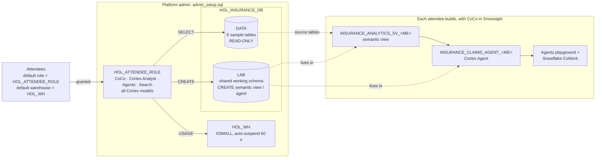

# Insurance HOL — Admin Guide

For the **platform admin** who prepares the customer account before the lab and cleans it up afterwards. Attendees follow [`LAB_GUIDE.md`](LAB_GUIDE.md).

| File | When | Purpose |
|---|---|---|
| `admin_setup.sql` | Before the lab | Creates the role, warehouse, sample data and shared lab schema, and onboards attendees |
| `admin_teardown.sql` | After the lab | Resets attendees and drops everything the setup created |
| `attendee_check_access.sql` | Attendees, Step 1 | Read-only privilege check |

## What gets built



All attendees share `HOL_INSURANCE_DB.LAB` and suffix their objects with `_<ME>`. `<ME>` is the user name in upper case, with every character other than `A-Z 0-9 _` replaced by `_`; for example, `jane.doe@corp.com` becomes `JANE_DOE_CORP_COM`. Everyone shares one role, so the suffix keeps work apart **by convention only**. That's acceptable for a workshop.

## 1. Prerequisites

| Check | How |
|---|---|
| You can use ACCOUNTADMIN, SECURITYADMIN and SYSADMIN | The script switches between them itself |
| Cross-region inference is allowed by your data-residency policy | `SHOW PARAMETERS LIKE 'CORTEX_ENABLED_CROSS_REGION' IN ACCOUNT;` CoCo in Snowsight requires it |
| CoCo in Snowsight isn't switched off | `CORTEX_CODE_SNOWSIGHT_DAILY_EST_CREDIT_LIMIT_PER_USER` is not `0` |
| The model allowlist doesn't block models | `SHOW PARAMETERS LIKE 'CORTEX_MODELS_ALLOWLIST' IN ACCOUNT;` should be `ALL`. It is an account-wide ceiling, so the all-models grant can't open models it excludes |
| Attendee users exist and can sign in | Note each user's **name** exactly as shown by `SHOW USERS` |
| SECURITYADMIN can alter the users (normally owned by `USERADMIN`) | If a SCIM provisioner role owns them, run section 4 as that role or as ACCOUNTADMIN |

## 2. Run `admin_setup.sql` (about 1 minute)

1. **Snowsight » Projects » Workspaces » + Add new » SQL file**, then paste `admin_setup.sql`.
2. **Section 1:** only if cross-region inference is `DISABLED`, uncomment the `ALTER ACCOUNT` line with a scope your policy allows.
3. **Section 4:** edit the attendee user list.
4. **Run All.** The script grants `HOL_ATTENDEE_ROLE`:
   - `SNOWFLAKE.COPILOT_USER`, `CORTEX_USER` and `CORTEX_AGENT_USER`;
   - `USE AI FUNCTIONS`;
   - **all Cortex models** (`CORTEX-MODEL-ROLE-ALL`);
   - `SELECT` on `DATA`;
   - `CREATE SEMANTIC VIEW / AGENT / CORTEX SEARCH SERVICE / TABLE / VIEW` on `LAB`;
   - `USAGE` / `OPERATE` on `HOL_WH`.

   It then sets each attendee's **`DEFAULT_ROLE = HOL_ATTENDEE_ROLE`** and **`DEFAULT_WAREHOUSE = HOL_WH`**.
5. **Checkpoint:**
   - row counts are CLAIM_NOTES 42, CLAIMS 36, and 45 for the other four tables;
   - `SHOW GRANTS OF ROLE HOL_ATTENDEE_ROLE` lists every attendee.

> **Why defaults are changed:** CoCo in Snowsight, Cortex Agents and Snowflake CoWork all start with the user's **default** role and warehouse, whatever is picked in the UI.
> **SCIM:** if Okta / Entra ID manages users, the IdP may overwrite defaults on its next sync. Set `defaultRole` / `defaultWarehouse` there instead.
> **Late joiners:** add them to the section 4 list and re-run just that block.

## 3. During the lab: Snowflake CoWork

Attendees open their agent in CoWork through **Preview in Snowflake CoWork** on the agent's page. This works with no extra setup.

Step 6 also has attendees **save and share a CoWork artifact**. Sharing is controlled account-wide: **AI & ML » Agents » Open settings » Snowflake CoWork » Data controls » Sharing artifacts and chats**. Leave it on for the lab, or tell attendees to skip 6.3. Shared links are visible to any account user who has access to the data.

If the account has a CoWork object (`SHOW SNOWFLAKE INTELLIGENCES;`), only agents added to it appear in the CoWork agent list. To list the attendee agents too, run this as ACCOUNTADMIN after attendees finish Step 4:

```sql
ALTER SNOWFLAKE INTELLIGENCE SNOWFLAKE_INTELLIGENCE_OBJECT_DEFAULT
  ADD AGENT HOL_INSURANCE_DB.LAB.INSURANCE_CLAIMS_AGENT_<ME>;   -- one per attendee
```

## 4. After the lab: run `admin_teardown.sql`

The teardown:
- for each user holding `HOL_ATTENDEE_ROLE`, **unsets** `DEFAULT_ROLE` / `DEFAULT_WAREHOUSE` if they still point at the lab, then revokes the role. Users whose defaults changed since are left alone. Pre-lab defaults aren't recorded, so re-set any your organisation requires;
- drops `HOL_INSURANCE_DB` (including every attendee's objects), `HOL_WH` and `HOL_ATTENDEE_ROLE`. Ask attendees to export anything worth keeping first;
- leaves account parameters unchanged.

## Admin troubleshooting

| Symptom | Fix |
|---|---|
| Attendee sees no CoCo icon, or "no access" | Re-check the prerequisites: cross-region inference, CoCo credit limit, `COPILOT_USER` |
| Access check query 2 shows `ASK YOUR ADMIN` | Re-run section 4 for that user (check the exact user name) |
| Agent call fails: model unavailable | Check `CORTEX_MODELS_ALLOWLIST` and `CORTEX_ENABLED_CROSS_REGION` |
| Agent missing from the CoWork list | Use **Preview in Snowflake CoWork**, or add the agent to the CoWork object (section 3) |

## Test log

Tested 2026-10-05 to 2026-10-08 in a Snowflake demo account (AWS us-east-1):
- **Setup:** `admin_setup.sql` ran clean with test users, including an e-mail-style name.
- **Attendee checks** (`USE SECONDARY ROLES NONE`):
  - the access check passed;
  - the reference semantic view and agent were created in LAB and owned by the role;
  - the Step 3.4 checkpoint matched;
  - the agent answered correctly through `DATA_AGENT_RUN`.
- **Guardrails:** attendees cannot create schemas or modify `DATA`.
- **Teardown, then setup again:** `admin_teardown.sql` reset defaults, revoked the role and dropped everything. A fresh setup then passed the access check.

  **Do a dry run as an onboarded attendee before delivery.**
