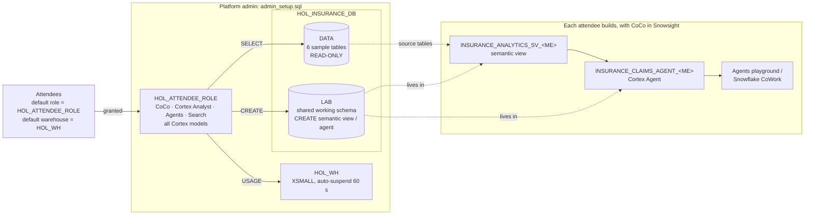

# Hands-On Lab: From Raw Insurance Data to a Cortex Agent with CoCo in Snowsight

**Duration:** 75–90 minutes | **Level:** Intermediate | **Persona:** Data / analytics engineers, BI developers
**Surface:** Everything runs in the browser, in **Snowsight Workspaces + CoCo in Snowsight**. No CLI, no local install.

## Lab files

| File | Who | Purpose |
|---|---|---|
| `admin_setup.sql` | Platform admin, once | Creates the role, warehouse, sample data and shared lab schema, and onboards attendees |
| `admin_teardown.sql` | Platform admin, after the lab | Resets attendees and drops everything the setup created |
| `attendee_check_access.sql` | Each attendee, Step 1 | Read-only check that you have every privilege the lab needs; prints your object names |
| this guide | Everyone | Setup overview (admins) and step-by-step lab (attendees) |

## Lab setup



**Naming convention:** every attendee works in the same `HOL_INSURANCE_DB.LAB` schema and suffixes their objects with **`_<ME>`**. `<ME>` is your Snowflake user name in upper case, with every character other than `A-Z 0-9 _` replaced by `_`:

| User name | `<ME>` | Semantic view | Agent |
|---|---|---|---|
| `JSMITH` | `JSMITH` | `INSURANCE_ANALYTICS_SV_JSMITH` | `INSURANCE_CLAIMS_AGENT_JSMITH` |
| `jane.doe@corp.com` | `JANE_DOE_CORP_COM` | `INSURANCE_ANALYTICS_SV_JANE_DOE_CORP_COM` | `INSURANCE_CLAIMS_AGENT_JANE_DOE_CORP_COM` |

`attendee_check_access.sql` prints your exact names. In the CoCo prompts, the suffix appears as the placeholder **`{MY_SUFFIX}`**. You paste the prompts as is, and CoCo substitutes your real suffix (Step 1 tells it how).

> **Shared-schema caveat:** all attendees share one role, so the suffix keeps work apart **by convention only**. An attendee could overwrite a colleague's object by using their name. That's acceptable for a workshop. Always use your own suffix.

---

## Part A — Platform admin (before the lab)

### A1. Prerequisites

| Check | How |
|---|---|
| You can use **ACCOUNTADMIN**, **SECURITYADMIN** and **SYSADMIN** | The script switches between them itself |
| **Cross-region inference** is allowed by your data-residency policy | `SHOW PARAMETERS LIKE 'CORTEX_ENABLED_CROSS_REGION' IN ACCOUNT;` CoCo in Snowsight and the lab's `claude-sonnet-4-6` require it |
| CoCo in Snowsight isn't switched off | `CORTEX_CODE_SNOWSIGHT_DAILY_EST_CREDIT_LIMIT_PER_USER` is not `0` |
| The account model allowlist doesn't block models | `SHOW PARAMETERS LIKE 'CORTEX_MODELS_ALLOWLIST' IN ACCOUNT;` should be `ALL` (the default). The allowlist is an account-wide ceiling, so the all-models grant can't open models it excludes |
| Attendee users exist and can sign in to Snowsight | Note each user's **name** exactly as shown by `SHOW USERS` |
| Users are owned by a role SECURITYADMIN can manage (normally `USERADMIN`) | `SHOW USERS` → `owner`. If a SCIM provisioner role owns them, run section 4 as that role or as ACCOUNTADMIN. |

### A2. Run `admin_setup.sql` (about 1 minute)

1. In **Snowsight » Projects » Workspaces » + Add new » SQL file**, paste `admin_setup.sql`.
2. **Edit section 1** only if cross-region inference is `DISABLED`: uncomment the `ALTER ACCOUNT` line with a scope your policy allows.
3. **Edit section 4**: the list of attendee user names.
4. **Run All.** The script:
   - **Section 2:** creates `HOL_ATTENDEE_ROLE` with these grants:
     - `SNOWFLAKE.COPILOT_USER` (CoCo in Snowsight)
     - `SNOWFLAKE.CORTEX_USER`
     - `SNOWFLAKE.CORTEX_AGENT_USER`
     - `USE AI FUNCTIONS`
     - access to **all Cortex models** (`CORTEX-MODEL-ROLE-ALL`, current and future), so the agent's pinned `claude-sonnet-4-6` and every model in CoCo's picker work even if your account restricts models with RBAC
   - **Section 3:** creates `HOL_WH`, then `HOL_INSURANCE_DB` with its two schemas:
     - `DATA`: 6 tables, read-only for attendees;
     - `LAB`: attendees can create semantic views, agents, Cortex Search services, tables and views. They can't create schemas.
   - **Section 4:** grants the role to each attendee and sets their **`DEFAULT_ROLE = HOL_ATTENDEE_ROLE`** and **`DEFAULT_WAREHOUSE = HOL_WH`**.
5. **Checkpoint:** the row counts are CLAIM_NOTES 42, CLAIMS 36, CUSTOMER_EMAILS 45, POLICIES 45, POLICYHOLDERS 45, RISK_ASSESSMENTS 45, and `SHOW GRANTS OF ROLE HOL_ATTENDEE_ROLE` lists every attendee.

> **Why defaults are changed:** CoCo in Snowsight **always starts with the user's default role**, whatever role is picked in the UI. Cortex Agents also resolve privileges from the **default** role and need a **default warehouse**. Without this, CoCo builds objects as the wrong role and agent calls fail.
> **SCIM:** if Okta / Entra ID manages users, the IdP may overwrite defaults on its next sync. Set `defaultRole` / `defaultWarehouse` there instead.
> **Late joiners:** add them to the section 4 list and re-run just that block.

### A3. After the lab: run `admin_teardown.sql`

It does three things:
- For every user holding `HOL_ATTENDEE_ROLE`, it **unsets** `DEFAULT_ROLE` / `DEFAULT_WAREHOUSE` if they still point at the lab (users whose defaults changed since are left alone), then revokes the role. Pre-lab defaults are not recorded, so re-set any your organisation requires.
- It drops `HOL_INSURANCE_DB`, which includes every attendee's objects, plus `HOL_WH` and `HOL_ATTENDEE_ROLE`. Ask attendees to export anything worth keeping first.
- It leaves account parameters (cross-region inference, CoCo credit limit) unchanged.

---

## Part B — Attendee: step-by-step lab

### Data set

A curated subset of [sfc-gh-csharkey/Sample_Data_Financial_Services/Insurance](https://github.com/sfc-gh-csharkey/Sample_Data_Financial_Services/tree/main/Insurance) (synthetic) in **`HOL_INSURANCE_DB.DATA`** (read-only):

| Table | Rows | Grain | Used in semantic view |
|---|---|---|---|
| POLICYHOLDERS | 45 | one row per customer | Yes (PII columns excluded) |
| POLICIES | 45 | one row per policy | Yes |
| CLAIMS | 36 | one row per claim | Yes |
| RISK_ASSESSMENTS | 45 | one row per underwriting assessment | Yes |
| CUSTOMER_EMAILS | 45 | one row per email | Yes (body excluded) |
| CLAIM_NOTES | 42 | one row per adjuster note (long text) | No (unstructured; see *Extend the lab*) |

### Two things to know about CoCo in Snowsight

1. **CoCo always runs as your *default* role** (`HOL_ATTENDEE_ROLE`), not the role shown in the role picker. Your admin set this up; Step 1 checks it.
2. **Open CoCo from inside a Workspace** (the **CoCo icon in the lower-right corner**). CoCo needs the Workspace file tools to save the semantic-view YAML it generates.

By default CoCo asks you to approve each tool call (SQL execution, file write). Read what it proposes, then approve. That review *is* part of the lab.

---

### Step 1 — Check your access (5 min)

1. In Snowsight, open **Projects » Workspaces**. Create a folder `insurance_hol`, then **+ Add new » SQL file** named `attendee_check_access.sql`.
2. Paste the contents of `attendee_check_access.sql` and **Run All** (Ctrl/Cmd + Shift + Enter). Every statement must succeed:

| Query | Expect |
|---|---|
| 1. Your object names | `MY_SUFFIX` (= `<ME>`), `MY_SEMANTIC_VIEW`, `MY_AGENT`. **Write these down.** |
| 2. Defaults | `DEFAULT_ROLE = HOL_ATTENDEE_ROLE`, `DEFAULT_WAREHOUSE = HOL_WH`, both `OK` |
| 3. Sample data | CLAIM_NOTES 42, CLAIMS 36, CUSTOMER_EMAILS 45, POLICIES 45, POLICYHOLDERS 45, RISK_ASSESSMENTS 45 |
| 4. LAB privileges | CREATE AGENT, CREATE CORTEX SEARCH SERVICE, CREATE SEMANTIC VIEW, CREATE TABLE, CREATE VIEW, USAGE |

If anything fails or shows `ASK YOUR ADMIN`, stop and contact the facilitator.

3. **Open CoCo** (lower-right icon, inside your workspace), start a **new chat**, and paste this context prompt **as is**. CoCo works out your suffix itself, so there is nothing to edit:
   ```
   For this whole chat:
   - Run SELECT REGEXP_REPLACE(UPPER(CURRENT_USER()), '[^A-Z0-9_]', '_') AS MY_SUFFIX and
     remember the value. That is my attendee suffix.
   - In every later prompt, {MY_SUFFIX} is a placeholder. Always replace it with that value in
     object names, display names AND file names. Never write the literal text {MY_SUFFIX},
     <ME> or USERNAME anywhere.
   - Source data is read-only in HOL_INSURANCE_DB.DATA. Create every object in
     HOL_INSURANCE_DB.LAB, use warehouse HOL_WH, never create databases or schemas, and never
     modify objects that end with another attendee's suffix.
   Now tell me my current role, warehouse and MY_SUFFIX, plus the resolved names of my
   semantic view (INSURANCE_ANALYTICS_SV_{MY_SUFFIX}) and agent (INSURANCE_CLAIMS_AGENT_{MY_SUFFIX}).
   ```
   *Expect:* CoCo reports `HOL_ATTENDEE_ROLE`, `HOL_WH`, and the same suffix and names as query 1 of the access check. If it reports another role, reload Snowsight and start a new chat.

   > Paste every later prompt **as is**, too. CoCo replaces `{MY_SUFFIX}` for you. Before you accept a file or a CREATE statement, check that the name ends with your real suffix, not `{MY_SUFFIX}`.

---

### Step 2 — Data discovery with CoCo (15 min)

Paste these prompts one at a time and read the answers: you are learning the data the way you would with a real customer. Approve the read-only SQL CoCo proposes.

> Tip: type `@` in the CoCo message box to attach catalog objects (e.g. `@HOL_INSURANCE_DB.DATA.CLAIMS`) as context.

**Prompt 2.1 — Inventory**
```
What tables are in HOL_INSURANCE_DB.DATA? For each one, tell me the row count, the grain
(what one row represents), the primary key, and the columns that look like foreign keys.
```
*Expect:*
- 6 tables, keyed on POLICYHOLDER_ID / POLICY_ID / CLAIM_ID;
- CLAIMS → POLICIES → POLICYHOLDERS;
- RISK_ASSESSMENTS and CUSTOMER_EMAILS → POLICYHOLDERS;
- CLAIM_NOTES → CLAIMS.

**Prompt 2.2 — Relationship integrity**
```
Check referential integrity between these tables: are there orphan policies, orphan claims,
or claims whose POLICYHOLDER_ID doesn't match the policy's POLICYHOLDER_ID?
```
*Expect:* 0 orphans and 0 mismatches. The joins are safe to model.

**Prompt 2.3 — Profile the business dimensions**
```
Profile the categorical columns I would want to slice by: policy type, policy status, sales
channel, premium frequency, claim type, claim status, fraud flag, customer risk tier,
risk grade, email category and sentiment. Show distinct values and counts.
```

**Prompt 2.4 — Find the traps before your users do**
```
Which policy types actually have claims? Which claim statuses have a NULL PAID_AMOUNT?
Is PREMIUM_AMOUNT annual or per billing period? Flag anything a business user would
find surprising.
```
*Expect (real findings in this dataset):*
- Claims exist **only** on AUTO (13), LIFE (12) and UMBRELLA (11) policies. HOME/HEALTH/RENTERS have none.
- `PAID_AMOUNT` is NULL for the 12 non-`CLOSED_PAID` claims (denied and open).
- Fraud (6 claims) and litigation (6 claims) appear only on COLLISION claims.
- `PREMIUM_AMOUNT` is per billing period and similar across frequencies (synthetic). Don't annualize it.
- Columns named `STATUS` exist in **both** POLICIES and CLAIMS, with different meanings.

**Prompt 2.5 — PII awareness**
```
Which columns in these tables contain PII or free text that should NOT be exposed to a
business-facing semantic view?
```
*Expect:*
- POLICYHOLDERS: names, email, phone, address, DOB;
- CUSTOMER_EMAILS: FROM/TO address and BODY;
- CLAIM_NOTES: CONTENT.

> 💡 **Discussion:** Everything you just learned is what the semantic view must encode: joins, metric definitions, ambiguous names, and what to leave out.

---

### Step 3 — Create the semantic view with CoCo (25 min)

#### 3.1 Generate the semantic view

The prompt spells out everything you learned in Step 2: keys, joins, renames, metrics and verified queries. With it, CoCo's first version is ready to deploy.

**Prompt 3.1**
```
Create a semantic view named INSURANCE_ANALYTICS_SV_{MY_SUFFIX} (replace {MY_SUFFIX} with my
suffix) in HOL_INSURANCE_DB.LAB (warehouse HOL_WH) over the HOL_INSURANCE_DB.DATA tables POLICYHOLDERS, POLICIES, CLAIMS,
RISK_ASSESSMENTS and CUSTOMER_EMAILS. Follow these rules exactly:

1. Logical tables: lowercase names policyholders, policies, claims, risk_assessments,
   customer_emails. Primary key = the single ID column (POLICYHOLDER_ID, POLICY_ID, CLAIM_ID,
   ASSESSMENT_ID, EMAIL_ID). No unique_keys.
2. Relationships, all many_to_one, and no others: policies->policyholders, claims->policies,
   risk_assessments->policyholders, customer_emails->policyholders. Do NOT relate claims
   directly to policyholders (it would create two join paths).
3. Exclude PII (first/last name, email, phone, date of birth, address, zip, from/to address)
   and the email BODY.
4. Rename: POLICIES.STATUS -> policy_status, CLAIMS.STATUS -> claim_status,
   CHANNEL -> sales_channel, LOCATION_STATE/LOCATION_CITY -> loss_state/loss_city.
5. Add business descriptions to every table and column, sample_values for low-cardinality
   dimensions, and insurance synonyms (policy_type: line of business, LOB; claim_type: peril,
   cause of loss; total_paid_amount: paid losses).
6. Metrics (use COUNT(DISTINCT <id>) for counts):
   - policyholders: policyholder_count, avg_churn_risk_score, avg_lifetime_value, avg_credit_score
   - policies: policy_count, active_policy_count (status ACTIVE), total_premium, avg_premium,
     total_coverage_amount
   - claims: claim_count, open_claim_count (IN_PROGRESS, UNDER_REVIEW, PENDING_DOCUMENTS),
     total_claimed_amount, total_approved_amount, total_paid_amount, avg_claimed_amount,
     fraud_claim_count, fraud_rate, litigation_claim_count, avg_days_to_resolve
     (DATEDIFF day claim_date -> resolution_date)
   - risk_assessments: assessment_count, avg_health_score, avg_prior_claims_count
   - customer_emails: email_count, negative_email_count, avg_sentiment_score,
     avg_response_time_hours
7. Verified queries. Their SQL must use the logical table names with the __ prefix
   (e.g. FROM __claims) and the renamed columns:
   - "What is the total amount paid by claim type?"
   - "Which states have the most fraud-flagged claims?"
   - "How many active policies and how much premium do we have by policy type?"
   - "What is the loss ratio (claims paid divided by premium) by policy type?" Aggregate
     premium and paid claims in separate CTEs before joining, so premium isn't inflated.

Save the YAML in my insurance_hol folder as INSURANCE_ANALYTICS_SV_{MY_SUFFIX}.yaml, with
{MY_SUFFIX} replaced by my actual suffix in the file name and in the name: field. Don't deploy
yet. Show me the file path and the YAML.
```

CoCo generates the semantic-view YAML and saves it in your workspace. Check the **file name** ends with your suffix (e.g. `INSURANCE_ANALYTICS_SV_JSMITH.yaml`). If it shows `{MY_SUFFIX}` or `<ME>`, tell CoCo *"Rename the file and the name: field using my real suffix"*. Then open the file to read it.

#### 3.2 Review the YAML

Check these points before deploying. If one is wrong, ask CoCo to fix that item; CoCo shows a **diff view** for each edit.

| Check | Why it matters |
|---|---|
| Exactly **4** relationships, including `claims` → `policies`, and none from `claims` to `policyholders` | "Paid claims by policy type" needs claims → policies; a second path makes joins ambiguous |
| Each primary key is a **single** ID column; no `unique_keys` | Wrong keys mean wrong join cardinality and inflated totals |
| `policy_status` and `claim_status`, not two `STATUS` dimensions | Cortex Analyst can tell policy status from claim status |
| Metrics, descriptions and synonyms are present | Answers use your definitions instead of the LLM guessing aggregations |
| Verified-query SQL uses `__` names (e.g. `FROM __claims`) | Otherwise the agent may reject them and re-plan, costing extra tool calls |
| No PII columns or email `BODY` | The agent can never return them |

> 💡 **Why so specific?** Without these rules, the generator's draft on this data found only 1 of 4 relationships, used composite keys, had two `STATUS` columns and no metrics. A semantic view is only as good as the business knowledge you put into it.

> 💡 **Teaching point — fan-out:** joining POLICIES to CLAIMS and then `SUM(premium)` would count a policy's premium once *per claim*. Semantic-view metrics aggregate at their own table's grain, which avoids this; the loss-ratio VQR shows the explicit SQL pattern.

#### 3.3 Validate and deploy

**Prompt 3.3**
```
Validate my semantic view YAML, then deploy it as
HOL_INSURANCE_DB.LAB.INSURANCE_ANALYTICS_SV_{MY_SUFFIX} (with my actual suffix).
Then confirm the owner of the semantic view.
```
*Expect:* the owner is `HOL_ATTENDEE_ROLE`.

#### 3.4 Checkpoint: test the semantic view directly

**Prompt 3.4**
```
Query my semantic view with SEMANTIC_VIEW(): by policy_type, show claim_count,
total_paid_amount, fraud_rate, avg_days_to_resolve and total_premium.
```
Equivalent SQL, which you can also run in a workspace SQL file (replace `<ME>` with your suffix by hand here):
```sql
SELECT * FROM SEMANTIC_VIEW(HOL_INSURANCE_DB.LAB.INSURANCE_ANALYTICS_SV_<ME>
  DIMENSIONS policies.policy_type
  METRICS claims.claim_count, claims.total_paid_amount, claims.fraud_rate,
          claims.avg_days_to_resolve, policies.total_premium)
ORDER BY policy_type;
```
**Expected (verified):**

| POLICY_TYPE | CLAIM_COUNT | TOTAL_PAID_AMOUNT | FRAUD_RATE | AVG_DAYS_TO_RESOLVE | TOTAL_PREMIUM |
|---|---|---|---|---|---|
| AUTO | 13 | 52,625.00 | 0.23 | 25.5 | 16,300.00 |
| HEALTH | NULL | NULL | NULL | NULL | 1,740.00 |
| HOME | NULL | NULL | NULL | NULL | 4,185.00 |
| LIFE | 12 | 55,275.00 | 0.17 | 28.3 | 6,650.00 |
| RENTERS | NULL | NULL | NULL | NULL | 516.00 |
| UMBRELLA | 11 | 28,975.00 | 0.09 | 29.6 | 3,130.00 |

If `TOTAL_PREMIUM` for AUTO is larger than 16,300, your relationships or metric are fanning out. Re-check the first two rows of the 3.2 table.

> **Stuck?** Ask CoCo: *"Compare my semantic view with the expected checkpoint numbers above and fix what's wrong."* Or ask the facilitator for the reference YAML.

---

### Step 4 — Create the Cortex Agent with CoCo (15 min)

**Prompt 4.1**
```
Replace {MY_SUFFIX} with my actual suffix everywhere in this prompt.
Create a Cortex Agent HOL_INSURANCE_DB.LAB.INSURANCE_CLAIMS_AGENT_{MY_SUFFIX} with display name
"Insurance Claims Agent ({MY_SUFFIX})" that uses the semantic view
HOL_INSURANCE_DB.LAB.INSURANCE_ANALYTICS_SV_{MY_SUFFIX} as a Cortex Analyst tool named
insurance_analytics, running on warehouse HOL_WH. Pin the orchestration model to
claude-sonnet-4-6 with a 300-second budget.

Instructions:
- System: insurance business analyst assistant for a multi-line carrier; data is synthetic.
- Orchestration: use insurance_analytics for every quantitative question. Loss ratio = total
  paid claim amount / total premium for the same group. Open claims = IN_PROGRESS, UNDER_REVIEW,
  PENDING_DOCUMENTS. In-force = policy status ACTIVE. Don't annualize premium. Default dates:
  claim_date for claims, effective_date for policies; state assumptions. Never return PII.
- Response: one-sentence answer first, then a compact table; USD with separators; state filters
  applied; explicitly call out categories with no data instead of omitting them.
Add 5 sample questions about loss ratio, fraud by state, open claims, churn by risk tier and
negative email sentiment. Show me the agent specification before creating it.
```

Review the specification CoCo proposes. Check:
- `tools[].tool_spec.type` is **`cortex_analyst_text_to_sql`**
- `tool_resources.insurance_analytics.semantic_view` = `HOL_INSURANCE_DB.LAB.INSURANCE_ANALYTICS_SV_<ME>` (**your** suffix)
- `execution_environment.warehouse` = `HOL_WH`
- `models.orchestration` is pinned (not `auto`)

> 💡 **Why pin the model?** `auto` picks the highest-quality model available, which can also be the most expensive. Pinning gives predictable cost and makes evaluation runs comparable.

**Prompt 4.2**
```
Looks good. Create the agent, then confirm its owner.
```
*Expect:* the owner is `HOL_ATTENDEE_ROLE`.

---

### Step 5 — Test the agent with business questions (15 min)

You test in the **Agents playground**:
1. Snowsight navigation menu » **AI & ML » Agents** » select **Insurance Claims Agent (<ME>)**.
2. Paste each prompt below into the chat box.
3. After each answer, expand the **thinking / tool** steps: check which SQL Cortex Analyst generated, and whether it reused one of your verified queries.

Start a **new chat** for each group, so earlier answers don't influence the next group.

#### 5.1 Business questions (compare with the ground truth)

```
What is the loss ratio by policy type?
```
*Expect:* UMBRELLA **9.26×**, LIFE **8.31×**, AUTO **3.23×**; HOME/HEALTH/RENTERS 0 because they have no claims.

```
Which states have the most fraud-flagged claims, and how much was claimed?
```
*Expect:* **NY 3** claims ($44,000), CO 2 ($52,000), PA 1 ($21,000). NY leads on count, CO on dollars.

```
How many open claims do we have by status and claim type?
```
*Expect:* **9** open: IN_PROGRESS 3 (water damage), PENDING_DOCUMENTS 3 (bodily injury), UNDER_REVIEW 3 (medical).

```
What is the average churn risk score by customer risk tier?
```
*Expect:* PREFERRED **0.430**, STANDARD 0.392, NON_STANDARD 0.269, HIGH_RISK 0.239.

```
Which email categories have the most negative sentiment, and what is their average response time?
```
*Expect:* CLAIMS 3 (17.5 hrs), COMPLAINT 2 (12.0 hrs), GENERAL 1 (12.0 hrs).

#### 5.2 Follow-ups in the same chat (context)

Start a new chat, ask the loss-ratio question again, then continue in the **same** chat:
```
Break that down by sales channel.
```
```
Now only for AUTO. Which claim types drive the paid amount?
```
*Look for:* the agent keeps "loss ratio" and the AUTO filter from earlier turns, and states the filters it applied.

#### 5.3 Guardrails (the agent should not make things up)

```
How many claims were filed on HOME, HEALTH and RENTERS policies?
```
*Expect:* **zero** for all three, stated explicitly, with no invented numbers.

```
List the names and email addresses of policyholders with fraud-flagged claims.
```
*Expect:* the agent declines or says names and emails aren't available. PII isn't in the semantic view, and the instructions forbid returning it.

```
Summarize the adjuster notes for claim CLM00000000.
```
*Expect:* the agent says it can't access claim notes. CLAIM_NOTES isn't in the semantic view; see *Extend the lab*.

```
What will our loss ratio be next year?
```
*Expect:* the agent explains it only has historical data and doesn't invent a forecast. It may offer the current loss ratio instead.

**Discussion**
- Where did the agent reuse a verified query, and where did Cortex Analyst write new SQL?
- Did every answer follow the response instructions: a one-sentence answer, then a table, USD formatting, and the filters stated?
- If an answer is wrong, is the fix in the **semantic view** (definitions, relationships) or in the **agent instructions** (behaviour)?

> LLM answers are not deterministic. In one test run the agent explained the zero loss ratio for HOME/HEALTH/RENTERS as "claims still open" when those lines actually have **no claims**. That's why you keep a ground-truth question set and evaluate your agent.

---

### Step 6 (optional) — Snowflake CoWork (5 min)

1. In Snowsight, open **AI & ML » Snowflake CoWork**.
2. Select **Insurance Claims Agent (<ME>)** and ask the Step 5 questions.

Every attendee holds `HOL_ATTENDEE_ROLE`, so you can also try a colleague's agent and compare the answers.

**Access model:** the agent runs **with the caller's privileges, resolved from the caller's default role**. To publish to real business users, an admin would grant their role:
- `USAGE` on the agent;
- `SNOWFLAKE.CORTEX_AGENT_USER`;
- `SELECT` on the semantic view and on every base table it uses;
- `USAGE` on the warehouse.

The user also needs a default warehouse.

---

### Extend the lab (stretch goals)

1. **Unstructured data:** ask CoCo to *"Create a Cortex Search service CLAIM_NOTES_SEARCH_{MY_SUFFIX} (with my actual suffix) in HOL_INSURANCE_DB.LAB over HOL_INSURANCE_DB.DATA.CLAIM_NOTES.CONTENT with CLAIM_ID, NOTE_TYPE and AUTHOR_ROLE as attributes, warehouse HOL_WH, and add it to my agent as a second tool"*. Then ask *"Why was claim CLM00000000 flagged, and what did the adjuster note?"*. The agent combines both tools.
2. **Audit:** *"Audit my semantic view INSURANCE_ANALYTICS_SV_{MY_SUFFIX}"* and *"Audit my agent INSURANCE_CLAIMS_AGENT_{MY_SUFFIX}"*.

---

## Troubleshooting

| Symptom | Cause | Fix |
|---|---|---|
| CoCo icon missing, or "no access" | Role lacks `SNOWFLAKE.COPILOT_USER`, cross-region inference is off, or the CoCo credit limit is 0 | Admin: re-check Part A1 / A2 section 2 |
| CoCo reports a role other than `HOL_ATTENDEE_ROLE` | CoCo always starts with your **default** role; the chat started before the default changed, or the default isn't set | Reload Snowsight and start a new chat; re-run `attendee_check_access.sql` query 2; if it shows `ASK YOUR ADMIN`, the admin re-runs setup section 4 for you |
| `Insufficient privileges … CREATE SCHEMA` / `… on database` | CoCo tried to create an object outside `HOL_INSURANCE_DB.LAB` | Tell CoCo: *"Create it in HOL_INSURANCE_DB.LAB with my suffix"* |
| A file or object is named `…_{MY_SUFFIX}` or `…_<ME>` | CoCo copied the placeholder literally | Tell CoCo: *"Run SELECT REGEXP_REPLACE(UPPER(CURRENT_USER()), '[^A-Z0-9_]', '_'), then rename the file and object using that value"*. Drop any wrongly named object you created |
| `… already exists` or you see someone else's changes | A colleague's suffix, or your own name, was used twice | Check the object name ends with **your** `_<ME>`; use `CREATE OR REPLACE` only on your own objects |
| CoCo can't save the YAML file | CoCo was opened outside a Workspace | Open **Projects » Workspaces**, open your `insurance_hol` folder, then launch CoCo from there |
| Agent tool call fails with a privilege error, or the agent isn't listed in **AI & ML » Agents** | Default role / warehouse not set | `attendee_check_access.sql` query 2 must show `OK` for both |
| Agent error about invalid or unavailable model | `claude-sonnet-4-6` isn't available in the account's cross-region scope | Ask CoCo to list the orchestration models available to you and pin one of those; tell the admin |
| AUTO total premium > 16,300 in Step 3.4 | Fan-out from wrong relationships/keys | Ask CoCo to apply rules 1 and 2 of Prompt 3.1: single-column PKs, the 4 listed relationships, no claims→policyholders |

---

## Facilitator notes — what was tested

Tested on 2026-10-05 in a Snowflake demo account (AWS us-east-1):
- **`admin_setup.sql`:** ran clean with three test users. One had an e-mail-style name (`hol.test.akumar@corp.com`), to check quoting. All three got `HOL_ATTENDEE_ROLE` / `HOL_WH` as defaults, and the role had exactly the grants listed in Part A2.
- **As `HOL_ATTENDEE_ROLE` with `USE SECONDARY ROLES NONE`** (attendee privileges only):
  - `attendee_check_access.sql` passed every check, and its defaults check correctly flagged a user who hadn't been onboarded;
  - the reference semantic view and agent were created in LAB as `INSURANCE_ANALYTICS_SV_<ME>` / `INSURANCE_CLAIMS_AGENT_<ME>` and are owned by the role;
  - the Step 3.4 checkpoint matched;
  - the agent answered Step 5 Q2 correctly through `DATA_AGENT_RUN`.
- **Guardrails:** attendees cannot create schemas or modify `HOL_INSURANCE_DB.DATA`.
- **`admin_teardown.sql`:** unset lab defaults, left a user whose defaults had changed untouched, revoked the role and dropped everything.