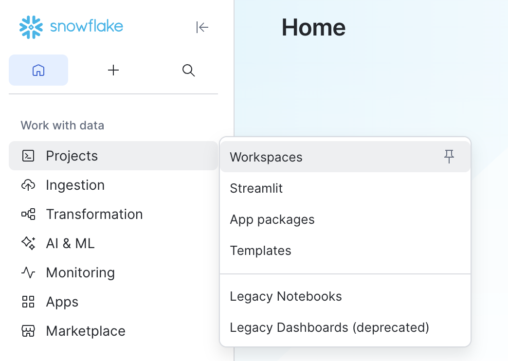
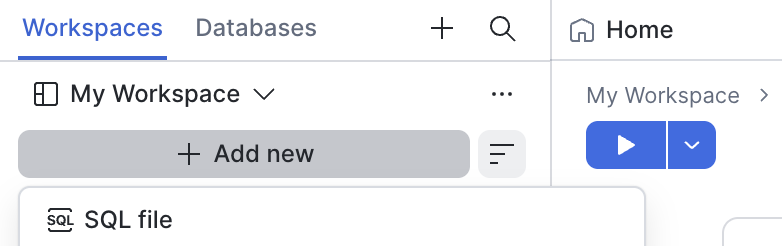
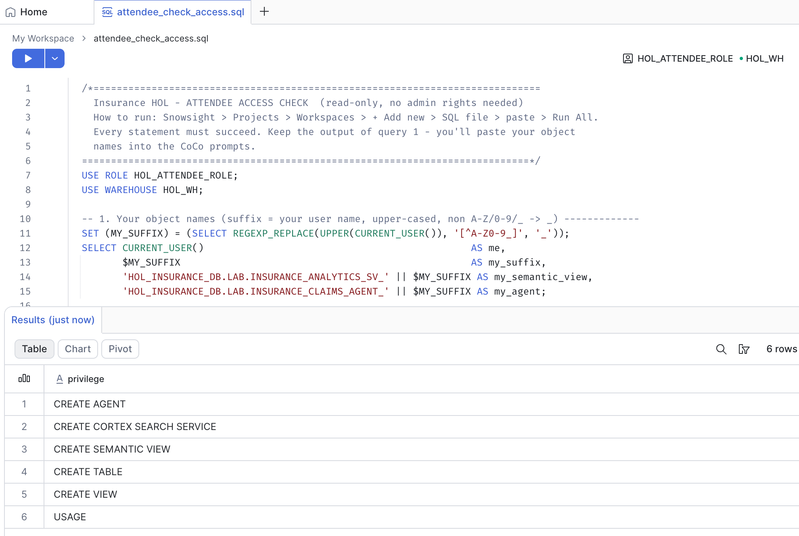
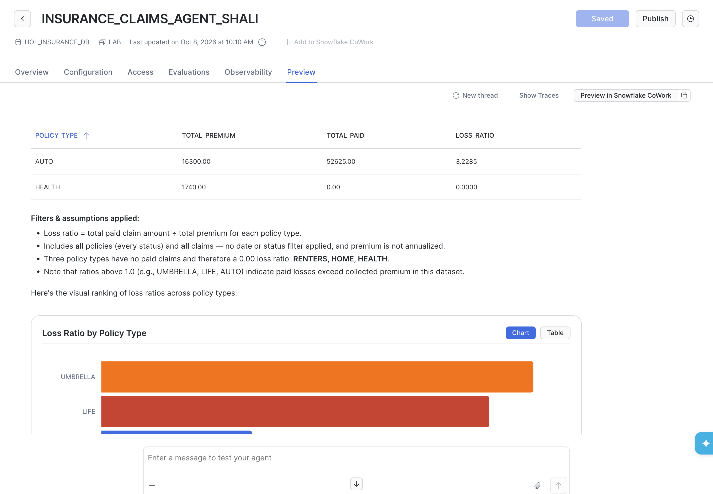
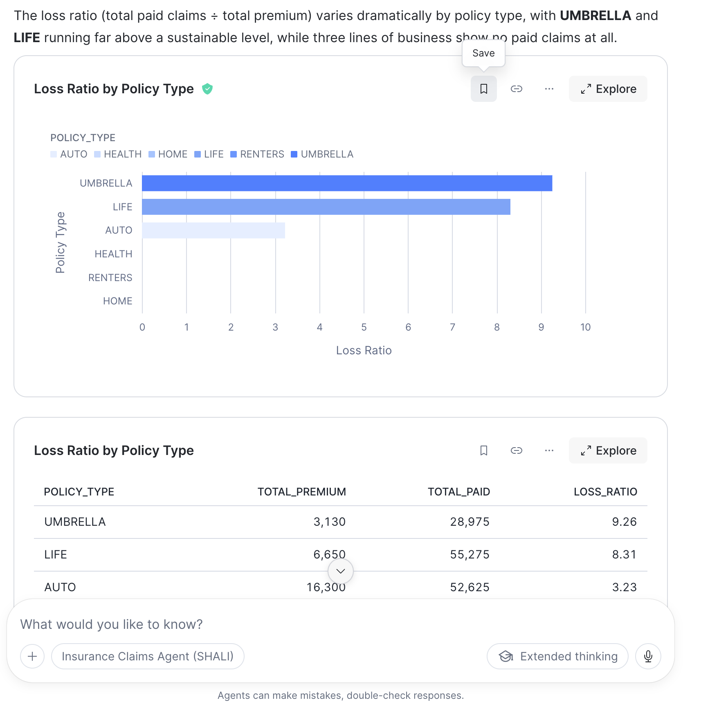
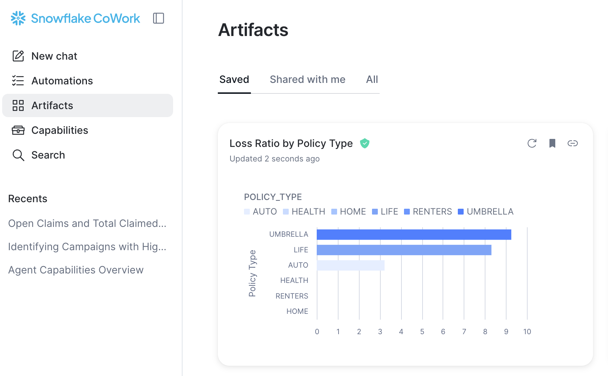

# Insurance HOL — Lab Guide: Semantic View → Cortex Agent with CoCo in Snowsight

**55-65 min · Intermediate · everything runs in Snowsight**: no CLI, no local install.

You'll use **CoCo in Snowsight** to explore insurance data, build a semantic view, and create a Cortex Agent that uses it to answer business questions. Then you'll test the agent in the Agents playground and in Snowflake CoWork, where you save and share the result as an artifact.

## Before you start

- **Your suffix.** Everyone works in the shared schema `HOL_INSURANCE_DB.LAB`. Each attendee's objects end with their own suffix: the user name in upper case, with non `A-Z 0-9 _` characters replaced by `_`. For example, `jane.doe@corp.com` becomes `JANE_DOE_CORP_COM`.
- **Paste prompts as is.** In the prompts the suffix appears as `{MY_SUFFIX}`, and CoCo substitutes your real one. Before you accept a file or a `CREATE`, check the name ends with your actual suffix.
- **CoCo runs as your default role** (`HOL_ATTENDEE_ROLE`), whatever the role picker shows.
- **Open CoCo from inside a Workspace** so it can save files.
- **CoCo asks before each SQL run or file write.** Read the proposal, then approve.

**Data** (synthetic, read-only, in `HOL_INSURANCE_DB.DATA`):

| Table | Rows | One row per |
|---|---|---|
| POLICYHOLDERS | 45 | customer |
| POLICIES | 45 | policy |
| CLAIMS | 36 | claim |
| RISK_ASSESSMENTS | 45 | underwriting assessment |
| CUSTOMER_EMAILS | 45 | email |
| CLAIM_NOTES | 42 | adjuster note (free text) |

---

## Step 1 — Check access (5 min)

1. **Projects » Workspaces**: create a folder `insurance_hol`, then **+ Add new » SQL file**.
    
    
2. Paste `attendee_check_access.sql` and **Run All**. Every query must succeed:
   - **1:** your suffix and object names;
   - **2:** `OK` for both defaults;
   - **3:** CLAIM_NOTES 42, CLAIMS 36, all others 45;
   - **4:** six privileges, including `CREATE SEMANTIC VIEW` and `CREATE AGENT`.

   If anything fails or shows `ASK YOUR ADMIN`, stop and tell the facilitator.

   

3. Open **CoCo** (lower-right icon in the workspace), start a **new chat**, and paste:
   ```
   For this whole chat:
   - Run SELECT REGEXP_REPLACE(UPPER(CURRENT_USER()), '[^A-Z0-9_]', '_') AS MY_SUFFIX and
     remember the value. That is my attendee suffix.
   - In every later prompt, {MY_SUFFIX} is a placeholder. Always replace it with that value in
     object names, display names AND file names. Never write the literal text {MY_SUFFIX},
     <ME> or USERNAME anywhere.
   - Source data is read-only in HOL_INSURANCE_DB.DATA. Create every object in
     HOL_INSURANCE_DB.LAB, use warehouse HOL_WH, never create databases or schemas, and never
     modify objects that end with another attendee's suffix.
   Now tell me my current role, warehouse and MY_SUFFIX, plus the resolved names of my
   semantic view (INSURANCE_ANALYTICS_SV_{MY_SUFFIX}) and agent (INSURANCE_CLAIMS_AGENT_{MY_SUFFIX}).
   ```
   *Expect:* `HOL_ATTENDEE_ROLE`, `HOL_WH`, and the same names as query 1. If the role is different, reload Snowsight and start a new chat.

---

## Step 2 — Discover the data (5 min)

Paste one prompt at a time. Tip: type `@` to attach a table as context.

**2.1 Inventory**
```
What tables are in HOL_INSURANCE_DB.DATA? For each one, tell me the row count, the grain
(what one row represents), the primary key, and the columns that look like foreign keys.
```
*Expect:*
- CLAIMS → POLICIES → POLICYHOLDERS;
- RISK_ASSESSMENTS and CUSTOMER_EMAILS → POLICYHOLDERS;
- CLAIM_NOTES → CLAIMS.

**2.2 Integrity**
```
Check referential integrity between these tables: are there orphan policies, orphan claims,
or claims whose POLICYHOLDER_ID doesn't match the policy's POLICYHOLDER_ID?
```
*Expect:* 0 orphans and 0 mismatches.

**2.3 Profile**
```
Profile the categorical columns I would want to slice by: policy type, policy status, sales
channel, premium frequency, claim type, claim status, fraud flag, customer risk tier,
risk grade, email category and sentiment. Show distinct values and counts.
```

> 💡 What you just learned (joins, ambiguous names, what to leave out) is exactly what the semantic view must encode.

---

## Step 3 — Build the semantic view (20 min)

**3.1 Generate**
```
Create a semantic view named INSURANCE_ANALYTICS_SV_{MY_SUFFIX} (replace {MY_SUFFIX} with my
suffix) in HOL_INSURANCE_DB.LAB (warehouse HOL_WH) over the HOL_INSURANCE_DB.DATA tables
POLICYHOLDERS, POLICIES, CLAIMS, RISK_ASSESSMENTS and CUSTOMER_EMAILS. Follow these rules exactly:

1. Logical tables: lowercase names policyholders, policies, claims, risk_assessments,
   customer_emails. Primary key = the single ID column (POLICYHOLDER_ID, POLICY_ID, CLAIM_ID,
   ASSESSMENT_ID, EMAIL_ID). No unique_keys.
2. Relationships, all many_to_one, and no others: policies->policyholders, claims->policies,
   risk_assessments->policyholders, customer_emails->policyholders. Do NOT relate claims
   directly to policyholders (it would create two join paths).
3. Exclude PII (first/last name, email, phone, date of birth, address, zip, from/to address)
   and the email BODY.
4. Rename: POLICIES.STATUS -> policy_status, CLAIMS.STATUS -> claim_status,
   CHANNEL -> sales_channel, LOCATION_STATE/LOCATION_CITY -> loss_state/loss_city.
5. Add business descriptions to every table and column, sample_values for low-cardinality
   dimensions, and insurance synonyms (policy_type: line of business, LOB; claim_type: peril,
   cause of loss; total_paid_amount: paid losses).
6. Metrics (use COUNT(DISTINCT <id>) for counts):
   - policyholders: policyholder_count, avg_churn_risk_score, avg_lifetime_value, avg_credit_score
   - policies: policy_count, active_policy_count (status ACTIVE), total_premium, avg_premium,
     total_coverage_amount
   - claims: claim_count, open_claim_count (IN_PROGRESS, UNDER_REVIEW, PENDING_DOCUMENTS),
     total_claimed_amount, total_approved_amount, total_paid_amount, avg_claimed_amount,
     fraud_claim_count, fraud_rate, litigation_claim_count, avg_days_to_resolve
     (DATEDIFF day claim_date -> resolution_date)
   - risk_assessments: assessment_count, avg_health_score, avg_prior_claims_count
   - customer_emails: email_count, negative_email_count, avg_sentiment_score,
     avg_response_time_hours
7. Verified queries. Their SQL must use the logical table names with the __ prefix
   (e.g. FROM __claims) and the renamed columns:
   - "What is the total amount paid by claim type?"
   - "Which states have the most fraud-flagged claims?"
   - "How many active policies and how much premium do we have by policy type?"
   - "What is the loss ratio (claims paid divided by premium) by policy type?" Aggregate
     premium and paid claims in separate CTEs before joining, so premium isn't inflated.

Save the YAML in my insurance_hol folder as INSURANCE_ANALYTICS_SV_{MY_SUFFIX}.yaml, with
{MY_SUFFIX} replaced by my actual suffix in the file name and in the name: field. Don't deploy
yet. Show me the file path and the YAML.
```
Check the file name ends with your suffix (e.g. `INSURANCE_ANALYTICS_SV_JSMITH.yaml`).

**3.2 Review.** Open the YAML and confirm:
- exactly **4** relationships, with none from claims to policyholders;
- single-column primary keys;
- `policy_status` and `claim_status`;
- metrics present;
- verified-query SQL uses `__` names;

If anything is off, ask CoCo to fix that one item. It shows a diff to review.

> 💡 **Fan-out:** joining POLICIES to CLAIMS and then summing premium counts each policy's premium once per claim. Semantic-view metrics aggregate at their own table's grain, which avoids this.

**3.3 Deploy**
```
Validate my semantic view YAML, then deploy it as
HOL_INSURANCE_DB.LAB.INSURANCE_ANALYTICS_SV_{MY_SUFFIX} (with my actual suffix).
Then confirm the owner of the semantic view.
```
*Expect:* the owner is `HOL_ATTENDEE_ROLE`.

**3.4 Checkpoint**
```
Query my semantic view with SEMANTIC_VIEW(): by policy_type, show claim_count,
total_paid_amount, fraud_rate, avg_days_to_resolve and total_premium.
```

| POLICY_TYPE | CLAIM_COUNT | TOTAL_PAID_AMOUNT | FRAUD_RATE | AVG_DAYS_TO_RESOLVE | TOTAL_PREMIUM |
|---|---|---|---|---|---|
| AUTO | 13 | 52,625 | 0.23 | 25.5 | 16,300 |
| HEALTH | – | – | – | – | 1,740 |
| HOME | – | – | – | – | 4,185 |
| LIFE | 12 | 55,275 | 0.17 | 28.3 | 6,650 |
| RENTERS | – | – | – | – | 516 |
| UMBRELLA | 11 | 28,975 | 0.09 | 29.6 | 3,130 |

If AUTO premium is above 16,300, the joins are fanning out: re-check the relationships and keys from 3.2. If you're stuck, ask CoCo *"Compare my semantic view with these expected numbers and fix what's wrong."*

**3.5 Test with Cortex Analyst (optional).** Before building the agent, check that Cortex Analyst turns natural-language questions into correct SQL over your semantic view.
1. **AI & ML » Cortex Analyst**, then select `INSURANCE_ANALYTICS_SV_<your suffix>`.
2. In the chat panel, ask the questions below. Expand each answer to see the generated SQL.

| Question | Expected |
|---|---|
| `How many active policies and how much premium do we have by policy type?` | Answered from your **verified query** (the answer is marked as verified) |
| `What is the average churn risk score by customer risk tier?` | No verified query, so new SQL: PREFERRED 0.430, STANDARD 0.392, NON_STANDARD 0.269, HIGH_RISK 0.239 |

> 💡 If an answer is correct, you can add it as a new verified query. Verified queries are the semantic view's ground truth: Cortex Analyst and your agent reuse them, and Cortex Analyst evaluations score against them.

---

## Step 4 — Create the agent (10 min)

**4.1**
```
Replace {MY_SUFFIX} with my actual suffix everywhere in this prompt.
Create a Cortex Agent HOL_INSURANCE_DB.LAB.INSURANCE_CLAIMS_AGENT_{MY_SUFFIX} with display name
"Insurance Claims Agent ({MY_SUFFIX})" that uses the semantic view
HOL_INSURANCE_DB.LAB.INSURANCE_ANALYTICS_SV_{MY_SUFFIX} as a Cortex Analyst tool named
insurance_analytics, running on warehouse HOL_WH. Set the orchestration model to auto, with a
300-second budget.

Instructions:
- System: insurance business analyst assistant for a multi-line carrier; data is synthetic.
- Orchestration: use insurance_analytics for every quantitative question. Loss ratio = total
  paid claim amount / total premium for the same group. Open claims = IN_PROGRESS, UNDER_REVIEW,
  PENDING_DOCUMENTS. In-force = policy status ACTIVE. Don't annualize premium. Default dates:
  claim_date for claims, effective_date for policies; state assumptions. Never return PII.
- Response: one-sentence answer first, then a compact table; USD with separators; state filters
  applied; explicitly call out categories with no data instead of omitting them.
Add 5 sample questions about loss ratio, fraud by state, open claims, churn by risk tier and
negative email sentiment. Show me the agent specification before creating it.
```
Check the spec:
- `models.orchestration: auto`;
- the tool type is `cortex_analyst_text_to_sql`;
- `semantic_view` uses **your** suffix;
- the warehouse is `HOL_WH`.

> 💡 `auto` lets Snowflake pick the best model available in the account and region.

**4.2**
```
Looks good. Create the agent, then confirm its owner.
```
*Expect:* the owner is `HOL_ATTENDEE_ROLE`.

---

## Step 5 — Test in the Agents playground (5 min)

**AI & ML » Agent Studio » Insurance Claims Agent (your suffix) » Preview**. Paste the prompts in order into one chat, then expand the tool step to see the generated SQL.



| Prompt | Expected |
|---|---|
| `What is the loss ratio by policy type?` | UMBRELLA 9.26×, LIFE 8.31×, AUTO 3.23×; HOME/HEALTH/RENTERS have no claims |
| `Break that down by sales channel.` | Keeps "loss ratio" from the previous turn and states the breakdown |
| `How many open claims do we have by status and claim type?` | 9: IN_PROGRESS 3 (water damage), PENDING_DOCUMENTS 3 (bodily injury), UNDER_REVIEW 3 (medical) |

---

## Step 6 — Test in Snowflake CoWork (15 min)

CoWork is the chat experience for business users.

**6.1 Ask.** In **AI & ML » Agent Studio**, open your agent and select **Preview in Snowflake CoWork**, then ask:

```
What is the loss ratio by policy type? Show it as a chart.
```
```
Which states have the most fraud-flagged claims, and how much was claimed?
```
*Expect:* the same loss ratios as Step 5, as a chart. Fraud: NY 3 claims ($44,000), CO 2 ($52,000), PA 1 ($21,000).



**6.2 Save an artifact.** An artifact is a saved chart or table that stays live: it keeps the SQL query and re-runs it against current data.
1. On the loss-ratio chart, select **Save**. Name it `Loss ratio by policy type ({MY_SUFFIX})`, using your real suffix.
2. Open the **artifacts hub**, find the artifact under **Saved**, and expand it. Select **Refresh** to re-run the query.
3. From the artifact, start a follow-up:
   ```
   Add total premium and total paid amount next to the loss ratio, as a table.
   ```
   *Expect:* a new thread that starts from the artifact's data. The original chat stays unchanged.



**6.3 Share it.** Open the artifact menu, copy its **share link**, and send it to a colleague in the lab. Open the link they send you: it appears under **Shared with me**.

> 💡 A shared artifact is a link, not a copy. It re-runs the query with the **viewer's** credentials, so RBAC, row access policies and masking apply to each viewer. Sharing can be turned off account-wide (CoWork settings » Data controls). If you see no share option, ask the facilitator.

> 💡 CoWork runs with **your** privileges and default role. To roll the agent out to business users, an admin grants their role `USAGE` on the agent, `CORTEX_AGENT_USER`, `SELECT` on the semantic view and its tables, and `USAGE` on the warehouse.

---

## Stretch goals

1. **Unstructured data:**
   ```
   Create a Cortex Search service CLAIM_NOTES_SEARCH_{MY_SUFFIX} (with my actual suffix) in
   HOL_INSURANCE_DB.LAB over HOL_INSURANCE_DB.DATA.CLAIM_NOTES.CONTENT with CLAIM_ID, NOTE_TYPE
   and AUTHOR_ROLE as attributes, warehouse HOL_WH, and add it to my agent as a second tool.
   ```
   Then ask the agent *"Why was claim CLM00000000 flagged, and what did the adjuster note?"*
2. **Audit:**
   ```
   Audit my semantic view INSURANCE_ANALYTICS_SV_{MY_SUFFIX} and my agent INSURANCE_CLAIMS_AGENT_{MY_SUFFIX}.
   ```

---

## Troubleshooting

| Symptom | Fix |
|---|---|
| No CoCo icon, or "no access" | Ask the admin (see `ADMIN_GUIDE.md`, Prerequisites) |
| CoCo reports a role other than `HOL_ATTENDEE_ROLE` | Reload Snowsight and start a new chat; re-run access check query 2 |
| A name contains `{MY_SUFFIX}` or `<ME>` | Tell CoCo: *"Run SELECT REGEXP_REPLACE(UPPER(CURRENT_USER()), '[^A-Z0-9_]', '_') and rename the file and object using that value"*. Drop any wrongly named object |
| `Insufficient privileges … CREATE SCHEMA` | Tell CoCo: *"Create it in HOL_INSURANCE_DB.LAB with my suffix"* |
| CoCo can't save the YAML | Open CoCo from inside your workspace folder |
| Agent missing from the CoWork agent list | Use **Preview in Snowflake CoWork** from the agent page |
| No **Save** or share option on a CoWork chart | Artifact sharing may be disabled for the account; ask the facilitator |
| Agent error: model unavailable | Ask the facilitator; the account's model allowlist or cross-region setting may block it |
