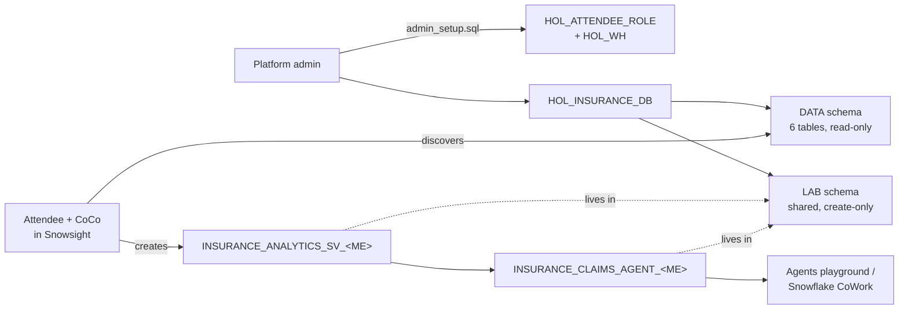

# Insurance HOL: Semantic View → Cortex Agent with CoCo in Snowsight

A hands-on lab where attendees use **Cortex Code (CoCo) in Snowsight** to:
1. discover a synthetic multi-line insurance data set;
2. build a **semantic view** over it;
3. create a **Cortex Agent** that uses the semantic view as a Cortex Analyst tool to answer business questions.

The lab is built for a **customer account**: a platform admin runs one setup script, and attendees need no admin rights. All attendees work in one shared schema and suffix their objects with their own user name.

## Files

| File | Who | Purpose |
|---|---|---|
| [`HOL_Insurance_SemanticView_to_CortexAgent.md`](HOL_Insurance_SemanticView_to_CortexAgent.md) | Admin + attendees | The full guide: Part A (admin) and Part B (step-by-step attendee lab with CoCo prompts and verified expected answers) |
| [`admin_setup.sql`](admin_setup.sql) | Platform admin | Creates the role, warehouse, database, sample data (inline, 36–45 rows per table) and grants. Onboards attendee users |
| [`admin_teardown.sql`](admin_teardown.sql) | Platform admin | Reverts user defaults, revokes the role and drops all lab objects |
| [`attendee_check_access.sql`](attendee_check_access.sql) | Attendees | Read-only check that every required privilege is in place. Prints the attendee's object names |

## Quick start

**Admin (before the lab)**
1. Open `admin_setup.sql` in a Snowsight SQL file and edit the attendee list in section 4.
2. Run All. You need ACCOUNTADMIN, SECURITYADMIN and SYSADMIN.
3. Check the prerequisites in Part A1 of the guide: cross-region inference, the CoCo credit limit, and the model allowlist.

**Attendees**
1. Run `attendee_check_access.sql` in a Snowsight workspace. Every statement must succeed.
2. Follow Part B of the guide:
   - discovery → semantic view → checkpoint → agent → Agents playground tests;
   - paste the CoCo prompts as is: CoCo works out your `{MY_SUFFIX}` itself.

**Admin (after the lab)**: run `admin_teardown.sql`.

## What the setup grants

`HOL_ATTENDEE_ROLE` is set as each attendee's **default role**, because CoCo in Snowsight and Cortex Agents run with the default role. It gets:
- `SNOWFLAKE.COPILOT_USER`, `CORTEX_USER` and `CORTEX_AGENT_USER`;
- `USE AI FUNCTIONS`;
- **all Cortex models** (`SNOWFLAKE."CORTEX-MODEL-ROLE-ALL"`);
- `USAGE` / `OPERATE` on `HOL_WH` (XSMALL, 60-second auto-suspend);
- `SELECT` on `HOL_INSURANCE_DB.DATA`;
- `CREATE SEMANTIC VIEW`, `AGENT`, `CORTEX SEARCH SERVICE`, `TABLE` and `VIEW` on `HOL_INSURANCE_DB.LAB`.

## Data

The sample data is a subset of [sfc-gh-csharkey/Sample_Data_Financial_Services/Insurance](https://github.com/sfc-gh-csharkey/Sample_Data_Financial_Services/tree/main/Insurance). All of it is synthetic. The tables are POLICYHOLDERS, POLICIES, CLAIMS, CLAIM_NOTES, CUSTOMER_EMAILS and RISK_ASSESSMENTS.
